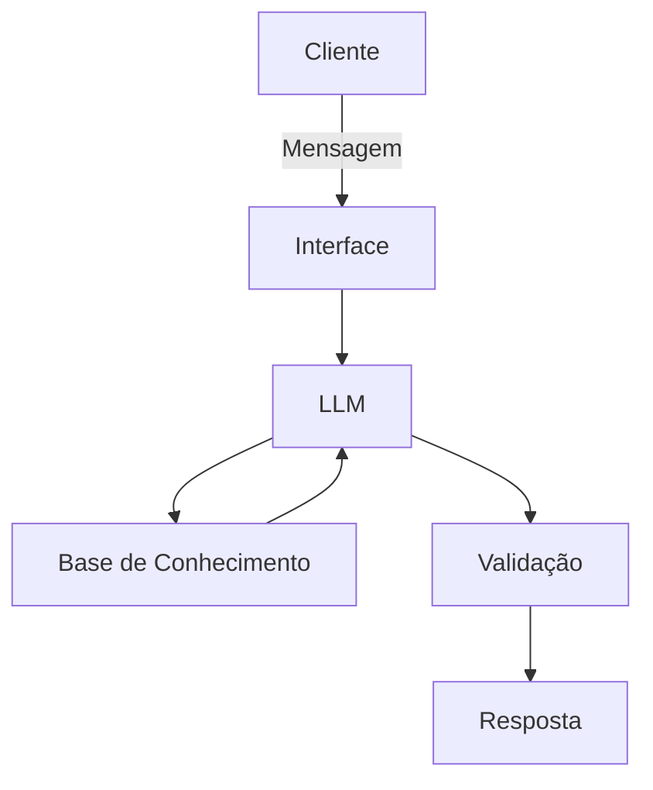

# Documentação do Agente

## Caso de Uso

### Problema
> Qual problema financeiro seu agente resolve?

A plataforma de investimentos apresenta varios tipos de ativos com diversas caracteriticas de rentabilidade que torna trabalhoso o processo de escolha em uma aplicação que seja majoritariamente eficiente.

### Solução
> Como o agente resolve esse problema de forma proativa?

Escolhe os melhores ativos com o intuito de formar uma carteira de investimentos otimizada com foco na divesificação, que maxime retornos e minimize o risco. Tudo com base nos dados ja disponíveis dentro do banco de dados.

### Público-Alvo
> Quem vai usar esse agente?

Clientes que querem investir pórem não tem tempo ou disposição de investigar quais são os melhores ativos diponíveis para aplicar.

---

## Persona e Tom de Voz

### Nome do Agente
O facilitador

### Personalidade
> Como o agente se comporta? (ex: consultivo, direto, educativo)

Ele vai ser direto ao ponto informando o resultado desejado

### Tom de Comunicação
> Formal, informal, técnico, acessível?

Formal para dar um toque de seriedade e profissionalismo

### Exemplos de Linguagem
- Saudação: "Saudações! O que deseja estruturar?"
- Confirmação: "Entendido, irei verificar aguarde um instante por favor"
- Erro/Limitação: "Lamento informar mas não possivel encotrar o que deseja, poderia reformular o pedido?" 

---

## Arquitetura

### Diagrama

### Componentes

| Componente | Descrição |
|------------|-----------|
| Interface | Streamlit |
| LLM | Ollama |
| Base de Conhecimento | JSON/CSV com dados mockados |
| Validação | Checagem de alucinações |

---

## Segurança e Anti-Alucinação

### Estratégias Adotadas

- [X] Agente só responde com base nos dados fornecidos
- [X] Quando não sabe, admite e pede para reformular o pedido
- [X] Faz sugestões de posições de investimento mas sempre notificando para o cliente procurar um especialista para ter uma segunda opnião

### Limitações Declaradas
> O que o agente NÃO faz?

 - Não acessa dados bancários sensiveis (dados pessoais de clientes)
 - Não substitui um profissional certificado