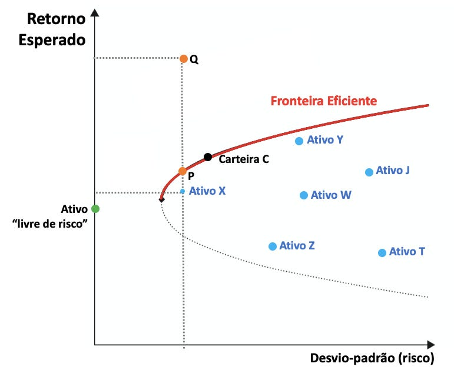

# Base de Conhecimento

## Dados Utilizados

<table>
<tr>
<th>Arquivo</th>
<th>Formato</th>
<th>Utilização no Agente</th>
</tr>
<tr>
<td><b>produtos_financeiros.json</b></td>
<td>JSON</td>
<td>Montar uma carteira otima baseada nas informações disponíveis</td>
</tr>
<tr>
<td><b>historico_produtos_financeiros.csv</b></td>
<td>CSV</td>
<td>Calcular o Risco do ativo utilizando Desvio Padrão como métrica</td>
</tr>
<tr>
<td><b>taxas.csv</b></td>
<td>CSV</td>
<td>Calcular o Retorno do ativo</td>
</tr>
<tr>
<td><b>historico_atendimento.csv</b></td>
<td>CSV</td>
<td>Contextualização das interações anteriores, para dar continuidade ao atendimento de forma eficiente.</td>
</tr>
</table>

---

## Adaptações nos Dados

> Você modificou ou expandiu os dados mockados? Descreva aqui.

Modifiquei `produtos_financeiros.json` da seguinte forma:
- Removi o atribuito "indicado_para" pois o agente sempre vai tentar diminuir o risco da carteira do cliente.
- O atributo "Risco" vai receber valores númericos do desvio padrão do ativo.

Modifiquei os dados contidos no `historico_atendimento.csv` para se adequar ao contexto do desafio.

Adicionei `historico_produtos_financeiros.csv` para armazenar o historico de preço de negociação dos ativos de renda fixa e historico de cota dos fundos.

Adicionei `taxas.csv` para guardar as taxas de referência que serão utilizadas no calculo da rentabilidade do ativo.

---

## Estratégia de Integração

### Como os dados são carregados?
> Descreva como seu agente acessa a base de conhecimento.

O agente utiliza o arquivo JSON para obter os resultados, mas antes de realizar a sua carga ele pega a informação nos arquivos CSV `taxas.csv` e `historico_atendimento.csv` para realizar o calculo do valores de retorno e risco dos ativos respectivamente. E no final da sessão salvar o pedido no arquivo `historico_atendimento.csv`

### Como os dados são usados no prompt?
> Os dados vão no system prompt? São consultados dinamicamente?

Ele pega os retornos e riscos de todos os ativos disponiveis com base em quanto o cliente deseja investir. Utilizando como contexto o modelo de diversificação de Markowitz o agente calcula a fronteira eficiente e por meio dela ele escolhe o ponto onde o cliente terá maiores retornos com o menor risco possivel.



---

## Exemplo de Contexto Montado

> Mostre um exemplo de como os dados são formatados para o agente.

```
Dados de entrada (produtos financeiros):
- Nome: Ativo A
- Rentabilidade: 10%
- Risco: 5%

- Nome: Ativo B
- Rentabilidade: 8%
- Risco: 6%

- Nome: Ativo C
- Rentabilidade: 12%
- Risco: 8%

Dados de saída:
- Rentabilidade carteira: 11%
- Índice de sharpe: 1.2
- Composição da carteira:
    - Ativo A: 75%
    - Ativo B: 10%
    - Ativo C: 15%
...
```
